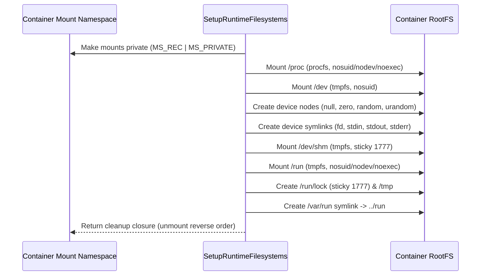

# Runtime Directories and Virtual Filesystems Specification

This document details the purpose, importance, and implementation specification for container virtual filesystems and runtime directories (`/proc`, `/dev`, `/sys`, `/run`, and supporting directories) inside **containy**.

It complements [`filesystem.md`](filesystem.md) (rootfs lifecycle and extraction) and [`bind-mount.md`](bind-mount.md) (user host volume mounts).

---

## 1. Overview & Purpose

Container workloads expect a standard Linux filesystem layout. Essential runtime directories are not stored in rootfs tarballs as static files; instead, they are dynamic virtual pseudo-filesystems (`procfs`, `sysfs`) or volatile in-memory filesystems (`tmpfs`) created and mounted by the container runtime during container initialization.

```
Container RootFS Path
├── /proc            (procfs - PID & process state)
├── /dev             (tmpfs - device nodes & pseudo-devices)
│   ├── shm          (tmpfs - POSIX shared memory)
│   ├── null, zero, random, urandom
│   └── fd, stdin, stdout, stderr -> /proc/self/fd/*
├── /run             (tmpfs - volatile runtime sockets/locks)
│   └── lock         (tmpfs directory for lock files)
├── /var/run -> ../run
└── /tmp             (sticky directory for ephemeral temp files)
```

---

## 2. Directory Breakdown & Importance

### 2.1 `/proc` (Process Information Filesystem)

* **Filesystem Type:** `procfs`
* **Mount Flags:** `MS_NOSUID | MS_NODEV | MS_NOEXEC` (Mode `0555`)
* **Why it's important:**
  * **PID Isolation:** Combined with Linux **PID namespaces**, mounting a fresh instance of `proc` ensures containerized applications only see processes running within their container (where container init is PID 1).
  * **Process & System Introspection:** Binaries, language runtimes (Go, Java, Python), and utilities (`ps`, `top`) depend on `/proc/self`, `/proc/[pid]/fd`, `/proc/mounts`, `/proc/meminfo`, and `/proc/cpuinfo` to inspect file descriptors, memory maps, and system resources.

---

### 2.2 `/dev` & `/dev/shm` (Device Nodes & Shared Memory)

* **Filesystem Type:** `tmpfs` (`mode=0755,size=16m`) for `/dev`, `tmpfs` (`mode=1777,size=64m`) for `/dev/shm`
* **Mount Flags:** `MS_NOSUID` (and `MS_NODEV` for `/dev/shm`)
* **Why it's important:**
  * **Isolated Device Tree:** Prevents containers from accessing physical host devices while supplying critical pseudo-devices required by standard programs.
  * **Character Device Nodes (via `mknod`):**
    | Device | Type | Major : Minor | Purpose |
    | :--- | :--- | :--- | :--- |
    | `/dev/null` | Character (`0666`) | `1:3` | Discard unwanted output stream data |
    | `/dev/zero` | Character (`0666`) | `1:5` | Stream of null bytes |
    | `/dev/random` | Character (`0666`) | `1:8` | Blocking entropy source for cryptographic operations |
    | `/dev/urandom` | Character (`0666`) | `1:9` | Non-blocking pseudo-random byte generator |
  * **Standard Stream & FD Symlinks:**
    * `/dev/fd` -> `/proc/self/fd`
    * `/dev/stdin` -> `/proc/self/fd/0`
    * `/dev/stdout` -> `/proc/self/fd/1`
    * `/dev/stderr` -> `/proc/self/fd/2`
  * **Shared Memory (`/dev/shm`):** Provides a high-performance in-memory POSIX shared memory segment for inter-process communication.

---

### 2.3 `/sys` and cgroups v2

The MVP does **not** mount `sysfs` or expose `/sys/fs/cgroup` inside the
container. The host supervisor configures the container leaf below the host's
cgroup v2 mount and uses `SysProcAttr.UseCgroupFD`/`CgroupFD` to place init into
that leaf atomically. Resource limits therefore apply without exposing host
kernel, device, or cgroup state through the rootfs.

Container-visible cgroup metrics can be added later using a cgroup namespace
and a dedicated read-only `cgroup2` mount at `/sys/fs/cgroup`; this does not
require mounting all of `/sys`.

---

### 2.4 `/run`, `/var/run`, and `/tmp` (Volatile State & Ephemeral Storage)

* **Filesystem Type:** `tmpfs` (`mode=0755,size=16m`) for `/run`
* **Mount Flags:** `MS_NOSUID | MS_NODEV | MS_NOEXEC`
* **Why it's important:**
  * **Volatile IPC & Lock Storage:** Daemons (e.g. Nginx, D-Bus, system services) require a clean location to place Unix domain sockets, lock files (`/run/lock`), and PID tracking files.
  * **`/var/run` Symlink:** Compatibility layer (`/var/run -> ../run`) for legacy UNIX programs expecting runtime state under `/var/run`.
  * **Ephemeral Storage (`/tmp`):** Guaranteed directory with sticky permission bit (`01777`) for temporary files created by applications.

---

## 3. Implementation in `containy`

In `containy`, virtual filesystems and runtime setup are implemented in [`internal/rootfs/runtimefs.go`](../internal/rootfs/runtimefs.go).

### 3.1 Setup Pipeline (`SetupRuntimeFilesystems`)



### 3.2 Key Security Controls in `containy`

1. **Mount Propagation Isolation (`MS_PRIVATE`):**
   Before mounting virtual filesystems, `containy` marks all mounts as `MS_REC | MS_PRIVATE` to prevent container mounts from leaking back to the host mount namespace.
2. **Symlink Traversal Prevention (`ensureDirectory`):**
   When creating directory targets within `rootfsDir` (such as `/proc` or `/dev`), `containy` checks each path segment to ensure target locations inside the rootfs are not malicious host symlinks.
3. **Rollback & Cleanup:**
   If any mount or initialization step fails, `SetupRuntimeFilesystems` unmounts all previously mounted filesystems in reverse order (`MNT_DETACH`) before returning the error.

---

## 4. Verification & Testing

Tests for runtime directory setup are located in [`internal/rootfs/runtimefs_test.go`](../internal/rootfs/runtimefs_test.go):

| Test Case | Description |
| :--- | :--- |
| `TestSetupRuntimeFilesystemsInPrivateNamespace` | Verifies `/proc`, `/dev`, `/dev/shm`, and `/run` filesystem types and confirms `/sys` is not sysfs. |
| `TestEnsureDirectoryRejectsSymlinkTraversal` | Ensures runtime mount targets cannot traverse a rootfs symlink. |
